# WLED

**Jetzt gibt es mehrere kommerzielle professionelle Versionen dieses Boards:**
* **NEW:** [ESP32 basiert, für 5V/12V/24V LEDs](https://shop.myhome-control.de/ABC-WLED-Controller-Board-5-24V/HW10015), zu kaufen [in meinem Shop](https://shop.myhome-control.de/ABC-WLED-Controller-Board-5-24V/HW10015) or **worldwide delivery soon by [WLED.SHOP](https://wled.shop)**
* [ESP8266 basiert](https://shop.myhome-control.de/ABC-WLED-Controller-V31-ESP8266/HW10002), zu kaufen [in meinem Shop](https://shop.myhome-control.de/ABC-WLED-Controller-V31-ESP8266/HW10002)
* [ESP32 basiert](https://shop.myhome-control.de/ABC-WLED-Controller-V41-ESP32/HW10003.1), zu kaufen auch [in meinem Shop](https://shop.myhome-control.de/ABC-WLED-Controller-V41-ESP32/HW10003.1)
* [Universelles WLED Shield für 5V / 12V LED Strips](https://shop.myhome-control.de/ABC-WLED-Basis-Board-fuer-5V-und-12V-LED-universell/HW10008), zu kaufen auch [in meinem Shop](https://shop.myhome-control.de/ABC-WLED-Basis-Board-fuer-5V-und-12V-LED-universell/HW10008)
* [Mini Controller Board mit ESP32](https://shop.myhome-control.de/ABC-WLED-Controller-Board-mini-5V-12V-ESP32/HW10014), zu kaufen auch [in meinem Shop](https://shop.myhome-control.de/ABC-WLED-Controller-Board-mini-5V-12V-ESP32/HW10014)
* Auch ein passendes Relais Board [in meinem Shop](https://shop.myhome-control.de/Relais-Board-fuer-WLED-Controller/HW10005)
* Und auch ein Line-In zu I2S Adapter für Sound Reactive WLED [in meinem Shop](https://shop.myhome-control.de/Line-In-zu-I2S-Adapter-fuer-WLED-Controller/HW10013)

Fragen? Kontaktieren Sie mich via Email: wled.controller@gmx.de

Einfaches WLED Board
 - Für 5V and 12V LED Streifen (unterschiedliche Bestückung möglich)
 - Beispiele für die Verbindung mit dem Netzteil/LED
 - Einfache Montage, Kein Kabelsalat, technisch saubere und sichere Ausführung
 - Software: https://github.com/Aircoookie/WLED
 - ESP32 in D1 mini Format kann anstatt ESP8266 verwendet werden, passt auch drauf (in WLED Konfiguration muss man dann GPIO 16 für Data und ggf. GPIO 17 für Clock einstellen).

## Die Platine (hier bestückt als Version für 5V LED)
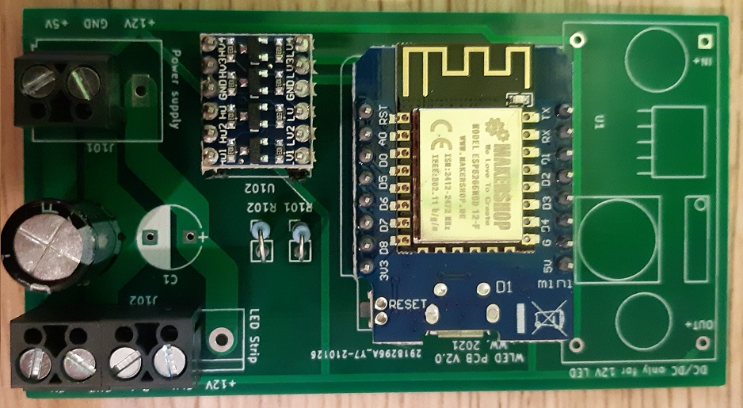
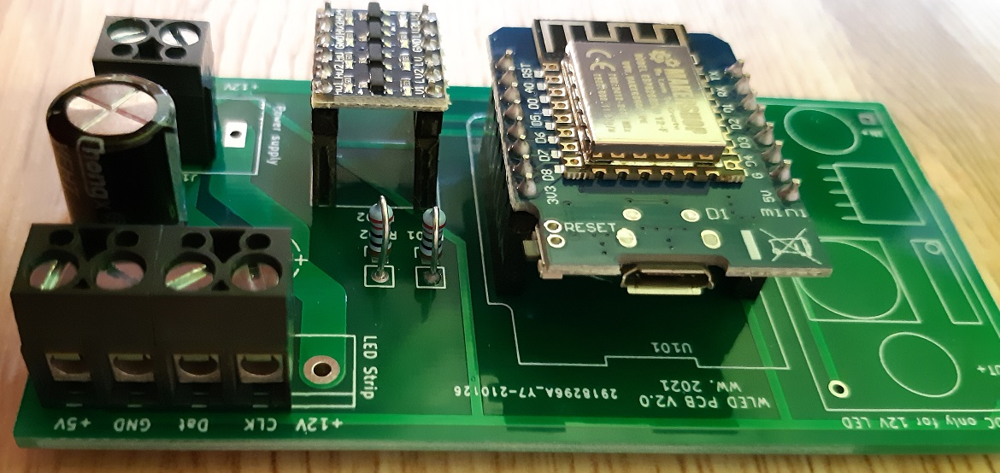

## Bestückt als Version für 12V LED mit WS2815 LED Streifen:
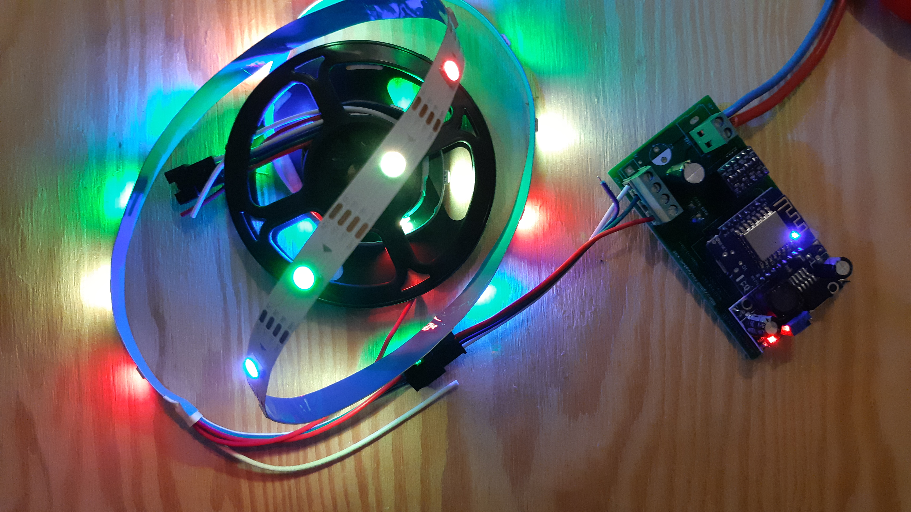

## Examples for connection
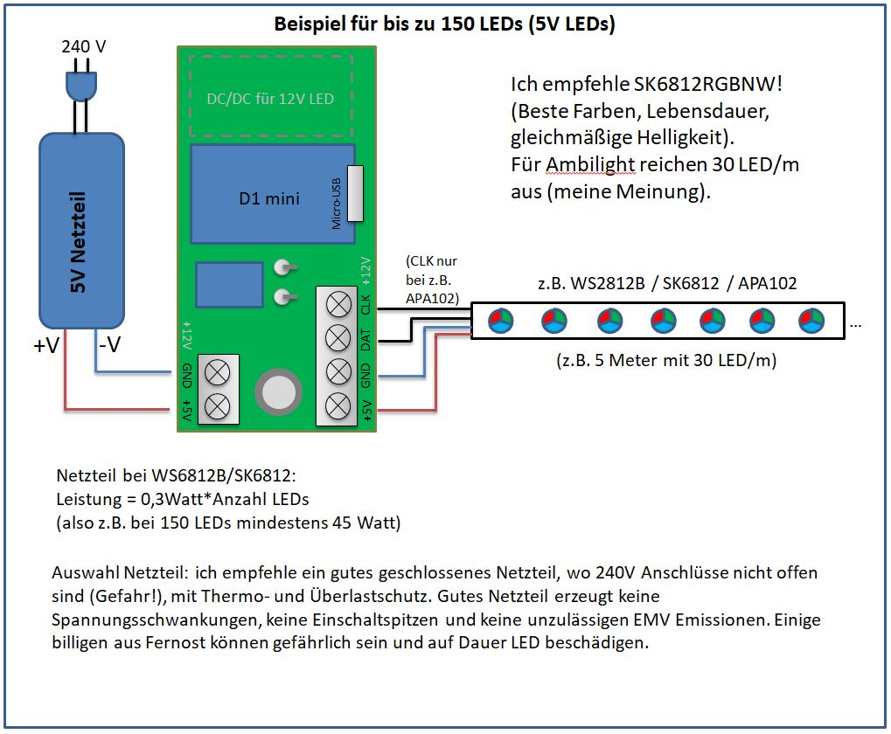
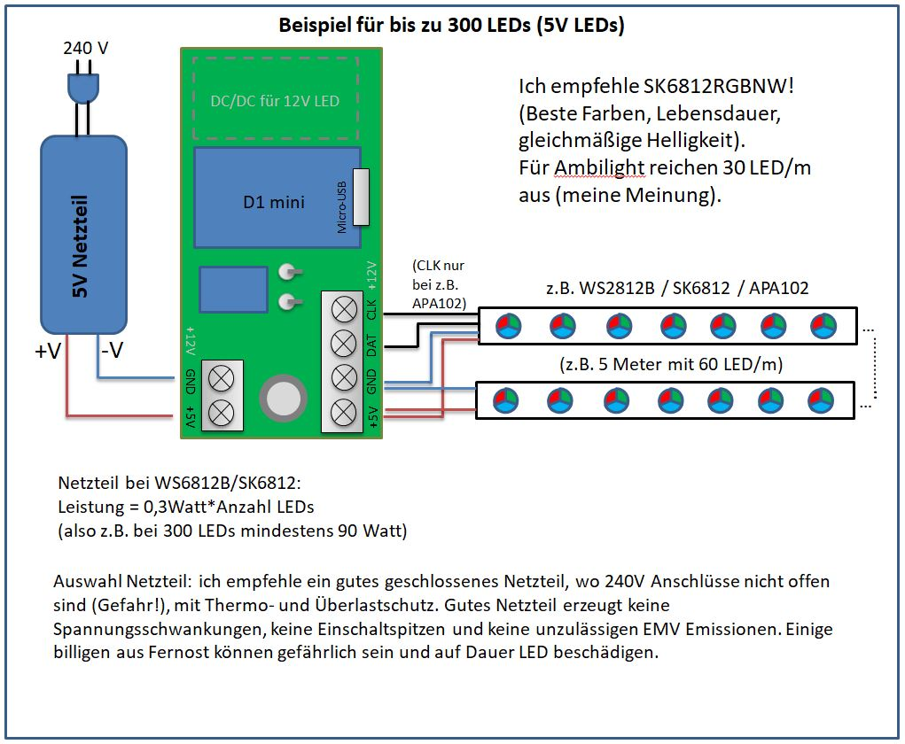
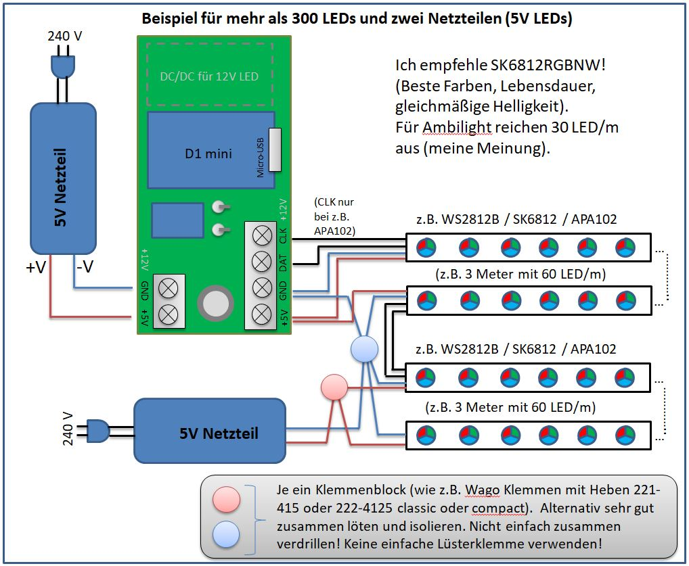
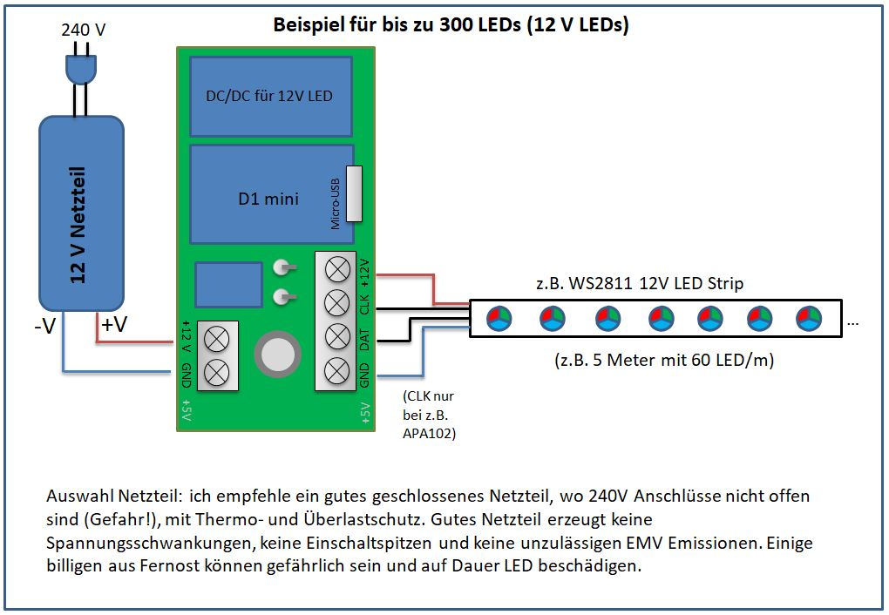

## How it works
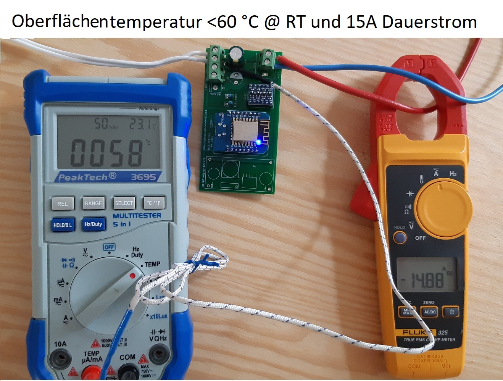
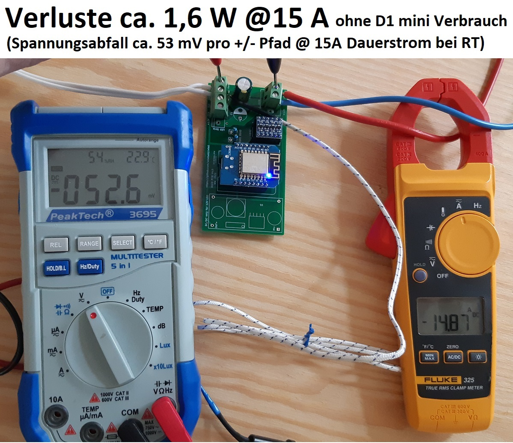
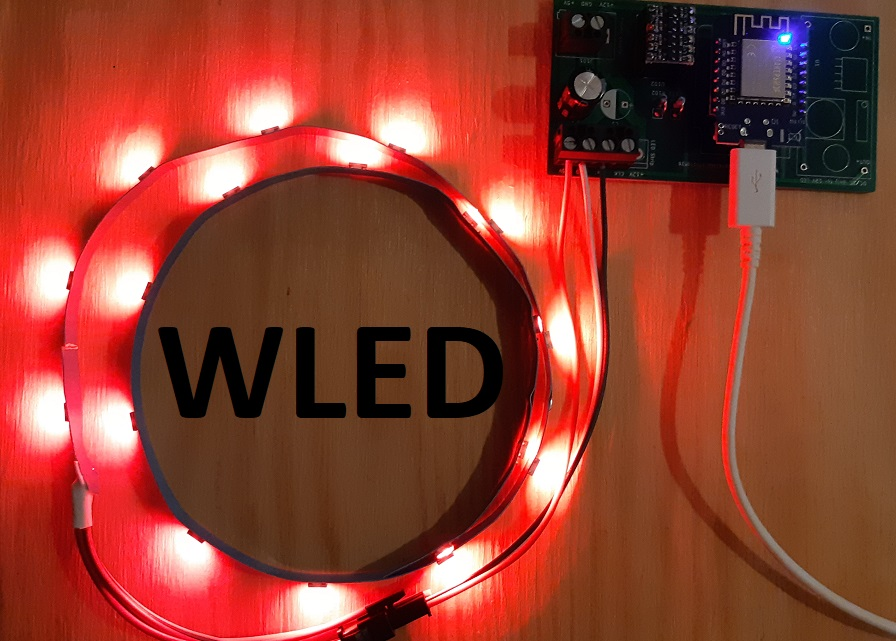
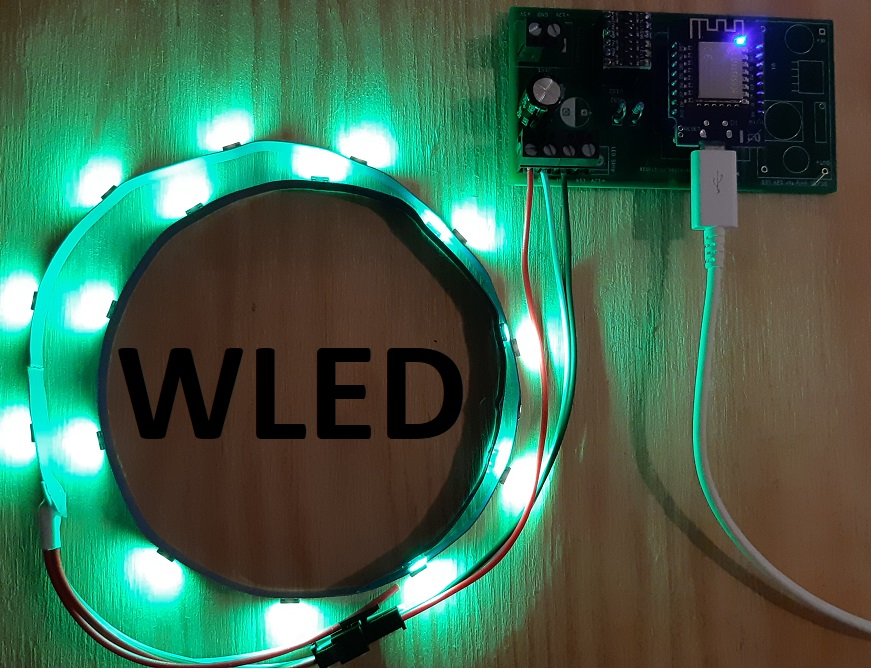
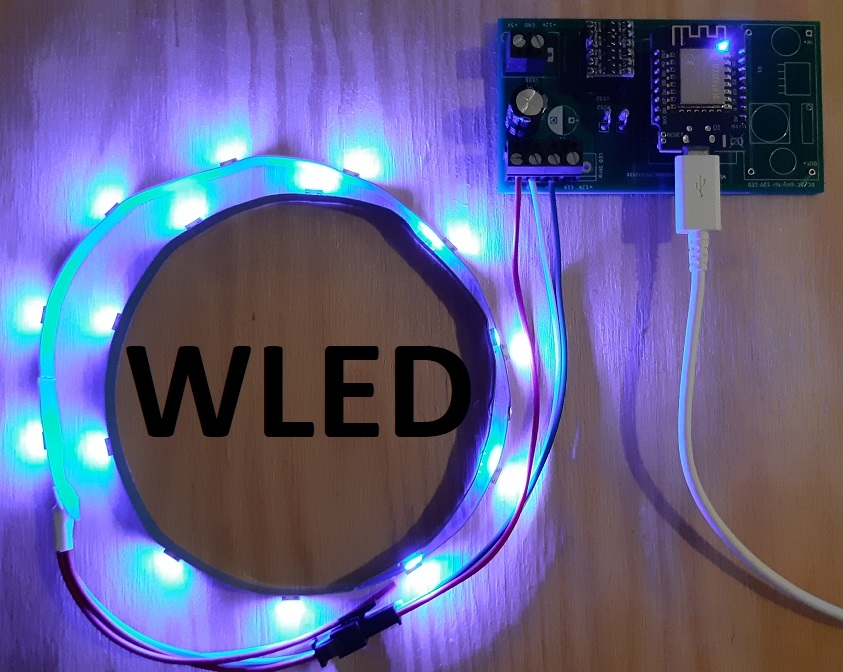

Alle Rechte sind vorbehalten. Jegliche kommerzielle Nutzung der Inhalte ohne Zustimmung des Autors ist nicht gestattet.
