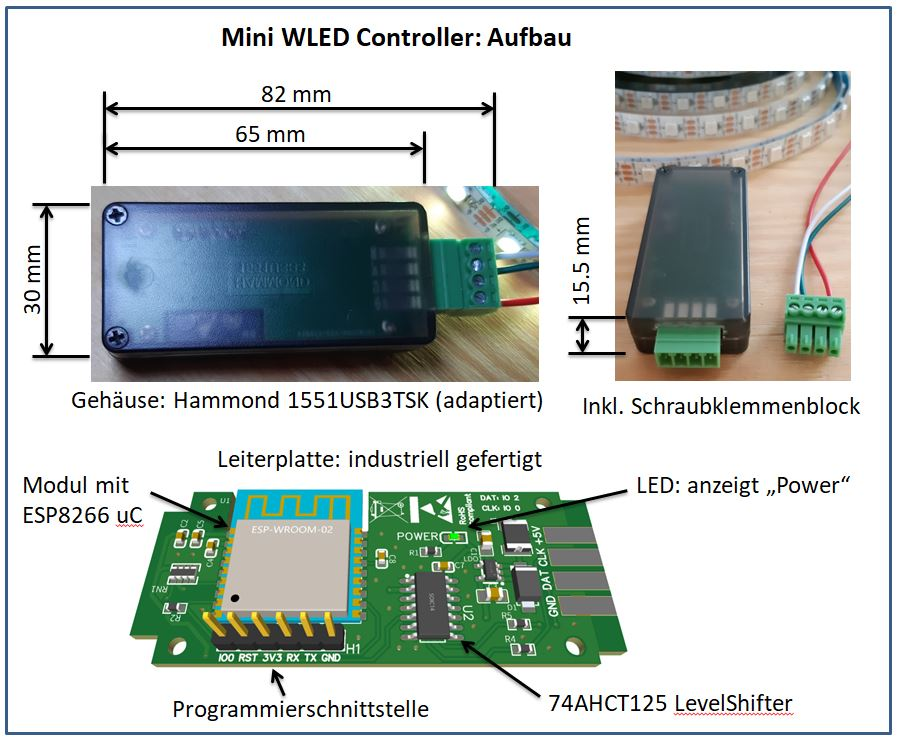
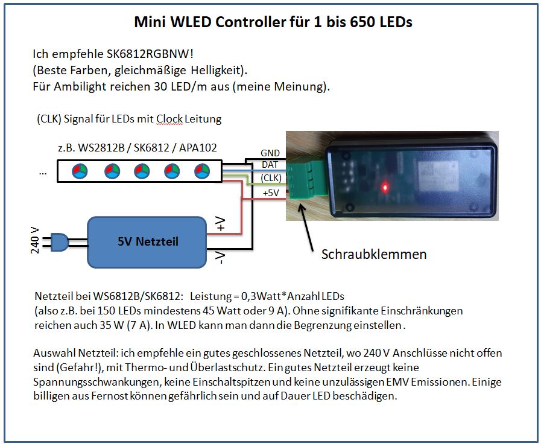
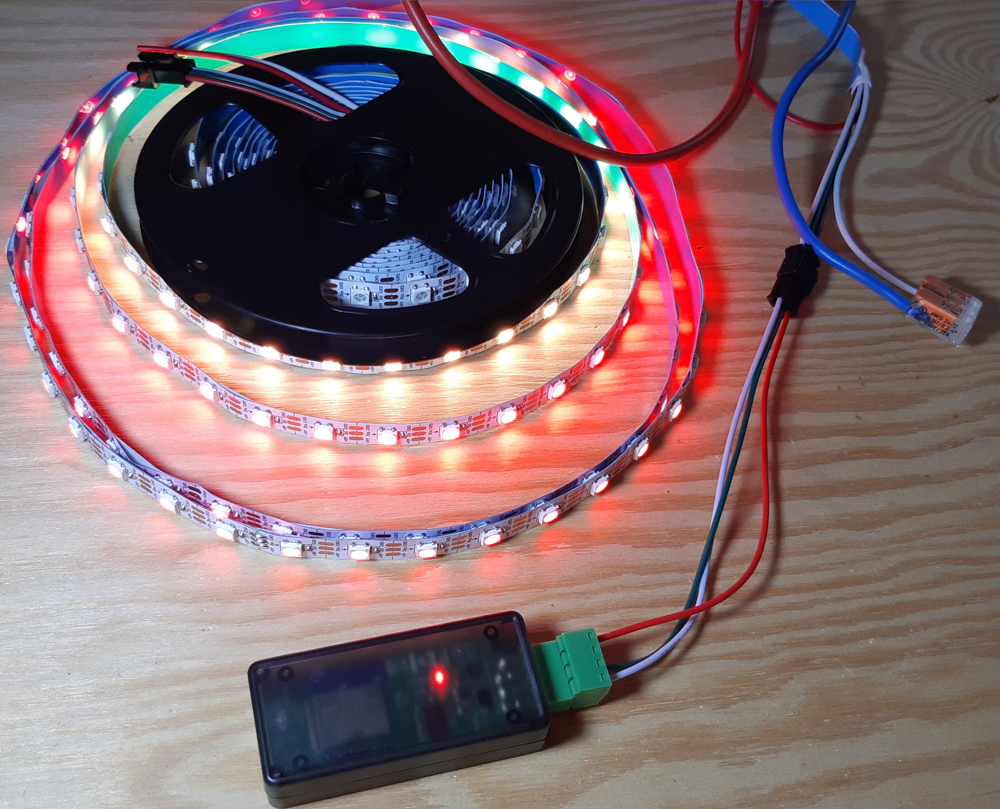

Für eine besondere Einbausituation habe ich mal eine möglichst kleine Version gebraucht. Das hier ist rausgekommen.
Gehäuse gibt es bei Conrad (Hammond 1551USB3xxx, xxx=je nach Farbe. Ich empfehle halbtransparent TSK - so siht man LED, sticht aber nicht inns Auge wenn dunkel ist). Der Ausschnitt für Schraubklemmenblock kann mit einem Cutter bearbeitet/vergrößert werden.

